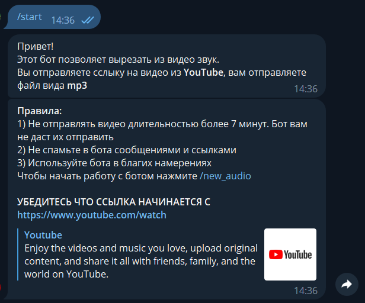

# Converter bot
___

This project works with YouTube for downloading audio-files from videos and Telegram bot for familiar interface.

The bot works only on russian language.

***
# Working process
***
<li> Step 1: Opening bot</li>

 Open the bot in Telegram search bar entering @CANvertor_bot or using https://t.me/CANvertor_bot

Attention! Please before starting read all rules

<li> Step 2: Downloading</li>

Choose /new_audio button and send link to bot. No metter how it starts, the main thing is that it should contain "youtu"

 In the example I used music video because the main aim of the project is to download music without any borders 

 Downloading of the file may take some time! 

<li> Step 3: Here we go!</li>

Congratulations! You get the audio track of the vidio. Telegram will play it as mp3 file, but if you try to play it on a phone, especially Android it will be played as mp4 file, but only with the audio.

Put /start button again in order to work with the bot again

Technologies that were used: pythonTelegramBotApi, pytube, moviepy

# Attention!

Due to the fact that pytube library works incorrect the bot also cannot work as usual. We are waiting the fixing of the problem.

